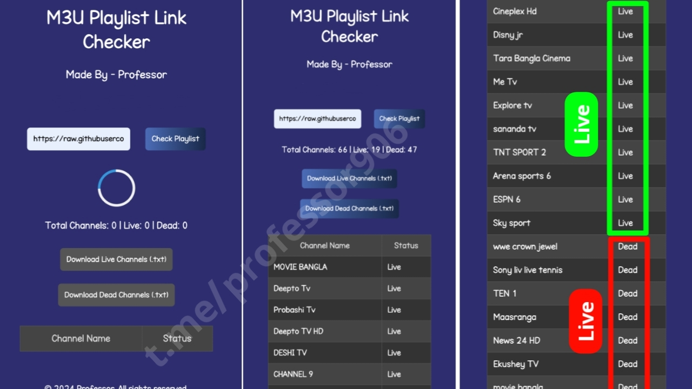

# M3U Playlist Checker

A simple and efficient tool for validating **M3U8 links**. This project allows users to check the status of M3U playlist links, determine if they are live or dead, and download the results.

---

## 🚀 Features

- **M3U8 Link Validation**:  
  Checks if M3U playlist links are active or dead.
  
- **Live/Dead Channel Separation**:  
  Displays live and dead channels separately.
  
- **Download Options**:  
  Allows downloading of live and dead channels in `.txt` format.
  
- **Security Features**:  
  - Right-click is disabled to prevent copying of code.  
  - Source code viewing is restricted with custom messages.

- **Modern UI**:  
  Responsive dark theme with a clean user interface.

---

## 🛠️ Technologies Used

- **HTML5**: For structuring the content and layout.
- **CSS3**: For styling and animations.
- **JavaScript**: For dynamic interactivity and fetching the playlist data.
- **PHP**: For processing and validating the M3U playlist links.

---

## 📂 Project Structure

- **index.php**: Main file containing the front-end UI and basic structure.
- **process.php**: PHP backend that processes the playlist URL, checks the status of channels, and returns the results.
- **style.css**: Styling for the responsive, dark-themed interface.
- **app.js**: JavaScript to handle user interactions like checking the playlist and downloading files.
**downloads/**: Folder where the live and dead channel lists are saved.
- **README.md**: Documentation of the project.
---

## 📸 Screenshots

### Main Interface

### Validation in Progress

---

## 📞 Contact

**Creator**: [Professor](https://t.me/professor906)  
**Email**: tfl906.bd@gmail.com

---

## 📜 License

This project is licensed under the MIT License.
